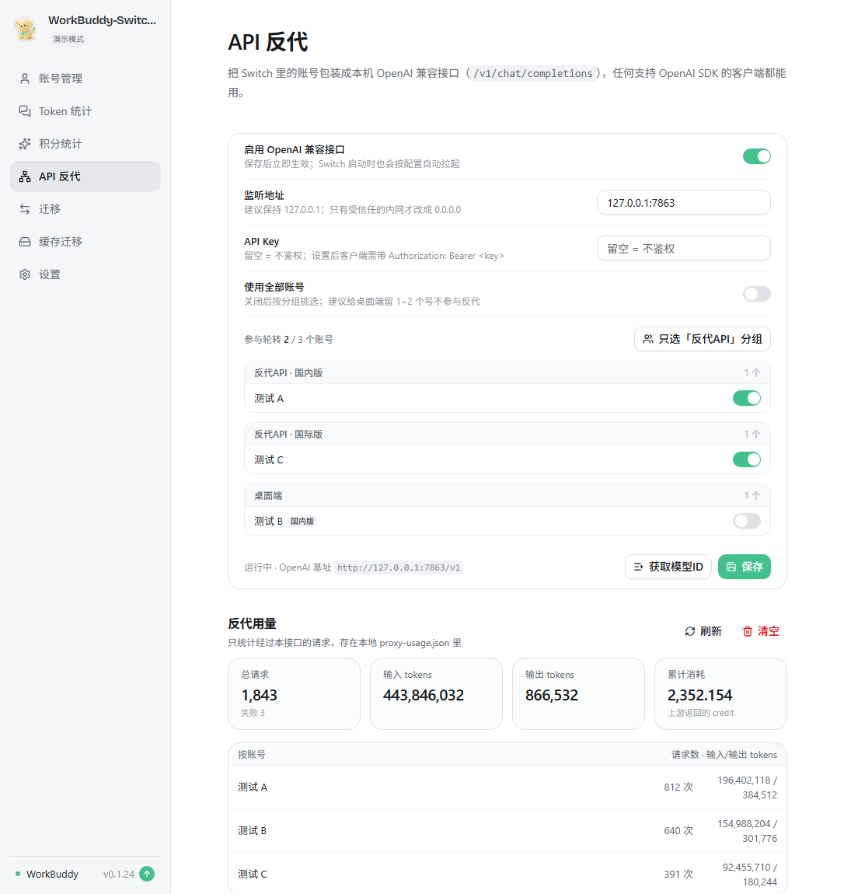

# API 反代（把 Switch 变成 OpenAI 兼容网关）

在 WorkBuddy Switch 里内置了一个本机 HTTP 服务，把你在 Switch 里管理的账号
包装成标准的 OpenAI 接口，任何支持 OpenAI SDK 的客户端都能直接用。

## 端点

| 方法 | 路径 | 说明 |
|---|---|---|
| POST | `/v1/chat/completions` | 对话补全，支持 `stream: true/false` |
| GET | `/v1/models` | 可用模型列表 |
| GET | `/healthz` | 健康检查 |
| GET | `/status` | 参与账号与运行状态 |

默认监听 `127.0.0.1:7863`，所以在客户端里填：

```
base_url = http://127.0.0.1:7863/v1
api_key  = （没设置就随便填，例如 sk-anything）
```

> ⚠️ **如果你开了梯子（系统代理 127.0.0.1:7897）**：部分 HTTP 客户端会把
> `127.0.0.1` 也送去走代理，导致连不上。请求失败时先设：
> ```
> no_proxy=127.0.0.1,localhost
> ```
> 或者在客户端里显式关掉代理。用 curl 验证时同理：`curl --noproxy '*' http://127.0.0.1:7863/healthz`

## 怎么用

侧边栏有独立的 **「API 反代」** 页（在「设置」上面）：

1. 打开 Switch → **API 反代**
2. 打开「启用 OpenAI 兼容接口」
3. 点**保存**（保存即生效，不用重启软件）
4. 状态行会显示 `运行中 · OpenAI 基址 http://127.0.0.1:7863/v1`

之后每次启动 Switch 都会自动拉起（配置存在 `~/.wb-switch/proxy.json`）。

## 取模型 ID（「获取模型ID」按钮）

「API 反代」页底部状态行右边有个 **「获取模型ID」** 按钮（就在「保存」左边）。
点一下会拉一次模型列表并弹窗展示，每行一个 ID、可单独复制，也能「复制全部」——
客户端里的 `model` 字段照着填就行，不用去翻文档猜 ID。

实现上分两步（`crates/wb-switch-core/src/modules/proxy.rs` 的 `fetch_models`）：

1. **反代开着** → 直接 GET 本机 `http://127.0.0.1:7863/v1/models`（有 api_key 会带上）。
   同一份数据、不额外占号、不消耗积分。
2. **反代没开** → 从账号库里挑一个可用账号（必要时先刷新 token）直连上游
   `/v2/enterprises/personal/models`，把 `data.agents[].models[]` 拆出来。

弹窗底部会写清数据来源（`本机反代` / `上游`）。拉不到时退回一组内置 ID，不会给空列表。
列表外的 ID 也能直接发（上游支持即可）。

## 国内版 / 国际版是两套上游（v1.0.6）

**两版的模型列表不一样**，所以反代侧做了三件事：

1. **账号按版本分开**：反代页把「反代API」这一组拆成「反代API · 国内版」和「反代API · 国际版」。其它组不拆，只在每行标一个版本徽标。
2. **模型列表分档拉**：「获取模型ID」两档各问一次上游，弹窗分两栏列，每档带自己的来源 URL 与「复制」。某一档没拉到时直接显示原因（比如没有该档账号）。
3. **请求按 model 自动挑版本**：拉过列表之后，反代记住了「这个 model 属于哪一档」，`/v1/chat/completions` 会**只在该版本的号里选**，不再拿国际版专属的模型去打国内版网关。

本机 `/v1/models` 返回**两档并集**，`owned_by` 标出来源：

| owned_by | 含义 |
|---|---|
| `workbuddy` | 两档都有 |
| `workbuddy-cn` | 只有国内版有 |
| `workbuddy-intl` | 只有国际版有 |

> 还没拉过模型列表时（冷启动），路由表是空的，行为退回原来的轮转 ——点一次「获取模型ID」即可填上。所以在客户端里报过「模型不存在」的话，先点一次那个按钮。

数据来源：

## 账号分组

账号管理页里，每张账号卡片右上角的 **⋯ 菜单 → 分组**，可以把它设为：

- **桌面端** —— 日常在 WorkBuddy 里聊天的号
- **反代API** —— 专门给 API 出站的号
- **未分组** —— 没归类

分组存在 `accounts.json` 每条账号记录的 `group` 字段里，随导出/导入一起走。

在「API 反代」页关掉「使用全部账号」后，账号列表会**按分组分区展示**，
并且有一个 **「只选反代API 分组」** 的快捷按钮 —— 一键把标了反代组的号全部选进轮转池。

推荐用法：给桌面端常用的 1~2 个号标「桌面端」，其余标「反代API」，
然后反代页里选「只选反代API 分组」。两边互不抢号。

## 用量统计

「API 反代」页下半部分有**反代用量**，统计经过本接口的每一次请求：

- 总请求 / 输入 tokens / 输出 tokens / 累计消耗（上游返回的 `credit`）
- 按账号拆分、按模型拆分
- 最近 8 条记录（时间、账号、模型、是否流式、token 数）
- 右上角可刷新 / 清空

数据存在 `~/.wb-switch/proxy-usage.json`，**服务没在运行时也能读历史**。
也可以直接查接口：`GET http://127.0.0.1:7863/usage-stats`。

实现上：非流式从聚合后的 `usage` 字段取；流式用一个 `UsageTap` 边转发边累积 SSE 原文，
流结束时解析最后一个 `usage` 块再落盘 —— 所以流式请求的消耗同样会被记到。

## 配置

`~/.wb-switch/proxy.json`：

```json
{
  "enabled": true,
  "listen": "127.0.0.1:7863",
  "api_key": "",
  "accounts": []
}
```

- `listen` —— 想让局域网其它机器访问才改成 `0.0.0.0:7863`（**务必同时设 api_key**）
- `api_key` —— 留空 = 不鉴权；设了之后客户端必须带 `Authorization: Bearer <key>`
- `accounts` —— 参与轮转的 uid 列表；**留空 = 全部账号**

## 设计要点（和别的实现的关键差别）

**它没有「两个进程各自刷新同一个 refresh token」的问题。**

常见的做法是单独跑一个网关进程，自己维护一份账号文件、自己刷新 token。
如果 Switch 同时也开着，两边调的是同一个刷新端点、且都会轮换 refresh token，
一旦撞车就会有一边拿到失效的 token。

这里的实现直接复用 Switch 自己的账号库（`~/.wb-switch/accounts.json`）和
它自己的刷新函数（`refresh::refresh_account_token`），**同一个进程、同一份状态**，
所以不存在跨进程竞争。

其它行为：

- 出站强制 `stream: true`（与上游一致），客户端要非流式时在本地聚合成一条
- 账号选择：健康账号轮转；失败的号冷却 120 秒后自动回到池子
- `needs_relogin` 的账号不参与
- 请求头对齐桌面端（含 `X-Conversation-*`、`X-B3-*` 等追踪头）

## 建议：给桌面端留 1~2 个账号

虽然是同一进程，但同一个账号**同时**被桌面端聊天和 API 调用时，上游可能限流、
积分消耗也会加快。所以在设置里关掉「使用全部账号」，把常用的 1~2 个号从反代里摘出去，
体验最好。

## 内容块降级（客户端兼容）

不是所有客户端都只发 `{"type":"text"}`。zcode / Cursor 这类 Agent 会发 OpenAI 较新的
`{"type":"file", ...}`、Responses 的 `input_file`、Anthropic 的 `document`，
而上游网关只认 text / image_url —— 原样透传就是一条 400：

```
{"code":11101,"msg":"Parse message failed: unsupported content type at index 0: file", ...}
```

反代现在会先把 `messages` 里的内容块过一遍：

| 内容块 | 处理 |
|---|---|
| `text` / `image_url` | 原样保留 |
| `file` / `input_file` / `document` / `image_file` / `input_audio` | 文本类附件（data URL 且 mime 是 text/*、json、xml…）解码成文本内联，上限 64 KB、超长截断；二进制（PDF/图片/音频）换成一行占位说明 `[file 附件 xxx 已省略：…]` |
| 其它未知类型 | 换成 `[xxx 内容块已省略：上游不支持该类型]` |

注意降级 ≠ 内容真的进了上下文：二进制附件的内容会被丢掉，模型只看到"这里本来有个附件"。
被降级时响应会带一个头便于排查：

```
x-wb-switch-degraded: file=1
```

好处是客户端不再因为一个附件块被整条打回 —— 长会话的自动 compact 最容易踩到，
因为它会把历史里所有附件块原样重发一遍。

## 已知限制

- 只做了 `/v1/chat/completions`，没有 embeddings / images / audio
- 工具调用（function calling）会透传给上游，但没有做额外的 schema 校验
- `/v1/models` 是从上游 `data.agents[].models[]` 里提取的，拉不到时回退到一个内置列表
- 上游只认 text / image_url，其它内容块会被降级成文本（见上）

## 源码位置

| 文件 | 作用 |
|---|---|
| `crates/wb-switch-core/src/modules/proxy.rs` | 服务本体：账号池、请求头、流式聚合、生命周期 |
| `src-tauri/src/commands.rs` | `get_proxy_config` / `save_proxy_config` / `get_proxy_status` / `set_account_group` |
| `src/pages/ApiProxyPage.tsx` | 独立的「API 反代」页（侧边栏「设置」上面） |
| `src/components/account-card.tsx` | 账号卡片：分组徽章 + 菜单里的分组设置 |
| `src/lib/api.ts`、`src/lib/types.ts` | 前端调用与类型 |

## 编译

```bash
export PATH="/f/Code/ENV/RUST/bin:$PATH"
export CARGO_HOME="F:/Code/ENV/RUST/cargo-home"
export RUSTUP_HOME="F:/Code/ENV/RUST/rustup-home"

npm install
npm run build                       # 先出 dist，Tauri 构建需要它
cargo build --release -p wb-switch-rust
# 产物：target/release/wb-switch-rust.exe
```

> 仓库归属已改为 `github.com/cv-superding/WorkBuddy-Switch2api`。
> `src-tauri/tauri.conf.json` 里 `updater.endpoints` 当前为空、
> `createUpdaterArtifacts` 为 false —— 这样自编译版不会被任何远端更新覆盖。
> 想开启自动更新时，把 endpoints 指向自己仓库的 releases 即可。
> 原配置备份在 `src-tauri/tauri.conf.json.orig`。
