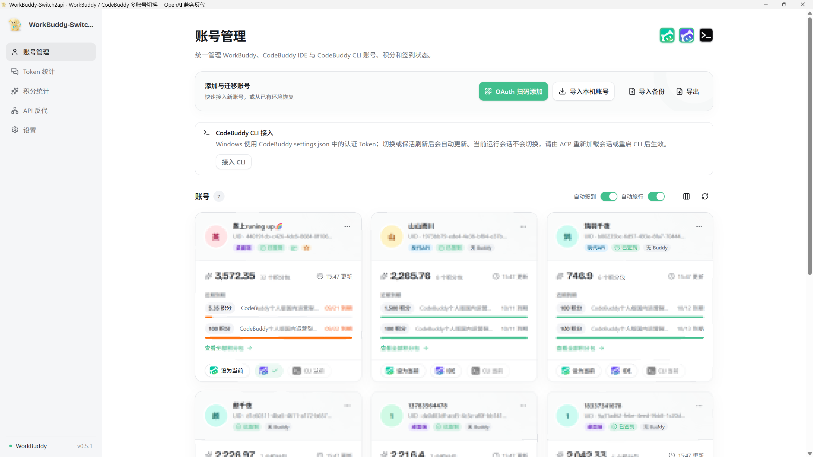
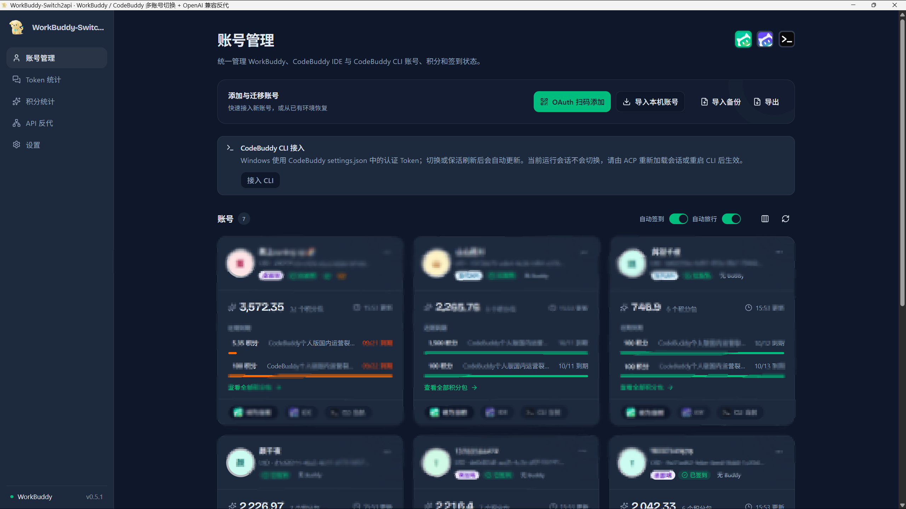
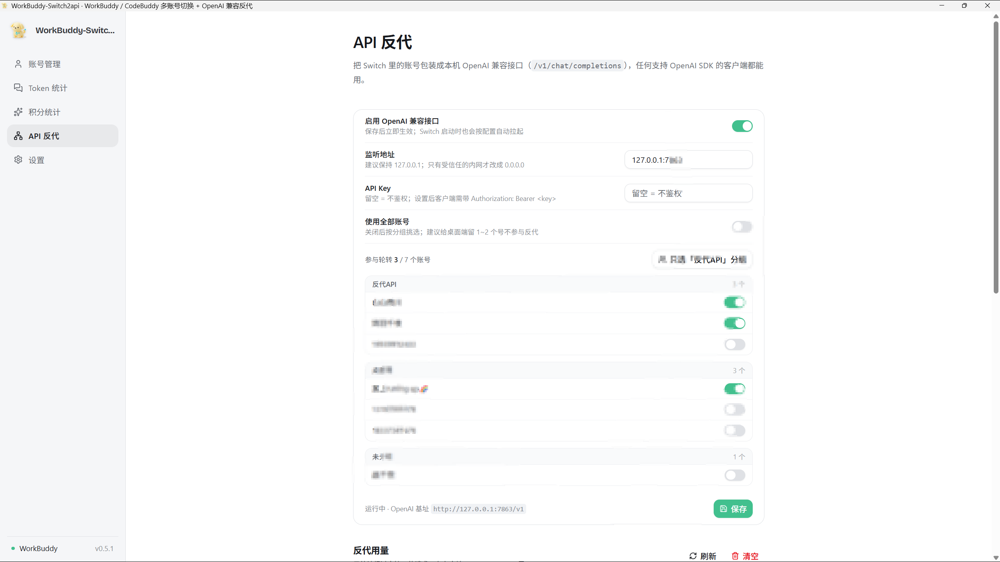
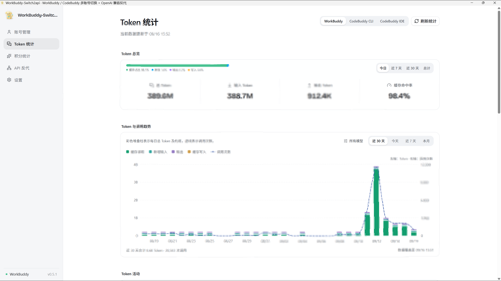
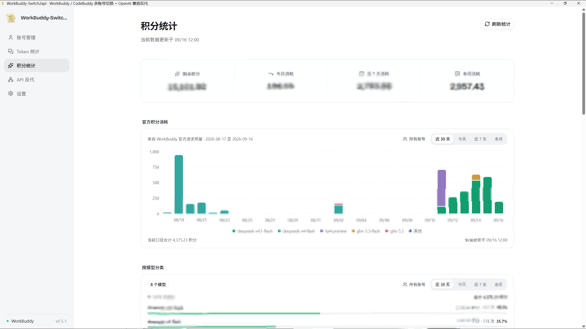
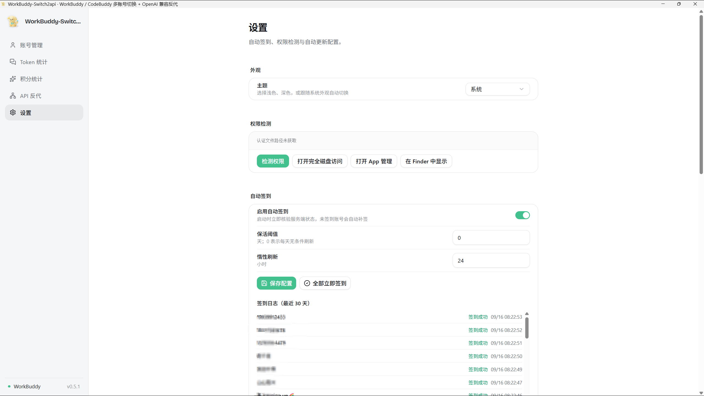
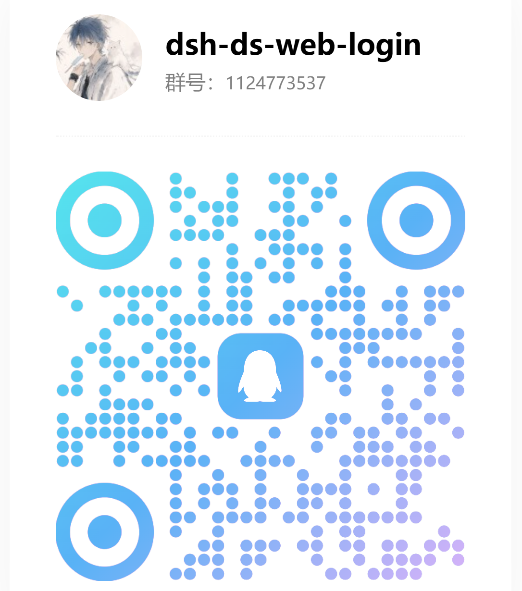

# WorkBuddy-Switch2api

<p align="center">
  
</p>

<p align="center">
  <strong>WorkBuddy-Switch2api</strong><br />
  WorkBuddy / CodeBuddy 多账号切换 + 本地 OpenAI 兼容反代
</p>

<p align="center">
  <a href="./LICENSE"></a>
  <a href="https://github.com/cv-superding/WorkBuddy-Switch2api/releases/latest"></a>
</p>

WorkBuddy / CodeBuddy CLI / CodeBuddy CN IDE 账号切换桌面 App（Tauri），并在同一个进程里内置了一个
OpenAI 兼容的本地网关：多账号池轮转、按分组挑选出站账号、请求用量一目了然。

- **账号切换** —— 多账号共享登录态，一键切换 WorkBuddy 登录账号，支持把当前会话复制给目标账号
- **API 反代** —— 把账号库包装成 `http://127.0.0.1:7863/v1`，任何 OpenAI SDK 客户端都能直接用
- **账号分组** —— 给账号标「桌面端 / 反代API」，两类用途互不抢号
- **用量统计** —— 反代请求数、输入输出 Token、按账号与按模型分布，落盘可查历史
- **积分与签到** —— 积分到期监控、自动签到、Token 保活、CodeBuddy CLI 自动轮换

> 反代和账号切换跑在**同一个进程**里，复用同一份账号库与刷新逻辑，
> 不存在「两个进程各自刷新同一个 refresh token」的冲突。

### 下载

- **桌面 App** —— 从 [GitHub Releases](https://github.com/cv-superding/WorkBuddy-Switch2api/releases/latest) 下载 macOS / Windows / Linux 安装包（推荐日常使用）
- **npm / webui** —— 浏览器操作界面，从本仓库自行构建安装，见下方「快速开始」
- **在线演示** —— [GitHub Pages 只读演示](https://cv-superding.github.io/WorkBuddy-Switch2api/)（账号、积分与请求记录均为虚构数据，所有业务操作已禁用）

## 快速开始

### npm / webui（本地构建）

浏览器操作界面，与桌面 App 共用同一套账号管理能力。该 npm 包**尚未发布到 npm**，从本仓库构建安装：

```bash
cd npm
npm i -g .
workbuddy-switch              # 启动本地服务 + 自动打开浏览器
workbuddy-switch status       # 终端查看当前账号
```

webui 界面与桌面 App 一致：WorkBuddy / CodeBuddy CLI / CodeBuddy IDE 账号切换、积分到期监控、自动签到、会话复制、API 反代、Token 统计与 token 保活。

### 桌面 App

前往 [GitHub Releases](https://github.com/cv-superding/WorkBuddy-Switch2api/releases/latest) 下载对应平台的安装包：

| 平台 | 安装包 | 安装方式 |
| --- | --- | --- |
| macOS Apple Silicon（M 系列，arm64） | `WorkBuddy-Switch2api_<版本>_aarch64.dmg` | 打开 DMG，将 `WorkBuddy-Switch2api.app` 拖入「应用程序」 |
| macOS Intel（x86_64） | `WorkBuddy-Switch2api_<版本>_x86_64.dmg` | 打开 DMG，将 `WorkBuddy-Switch2api.app` 拖入「应用程序」 |
| Windows x64 | `WorkBuddy-Switch2api_<版本>_x64-setup.exe` | 运行安装程序并按提示完成安装 |
| Linux x64 | `WorkBuddy-Switch2api_<版本>_amd64.deb` / `WorkBuddy-Switch2api_<版本>_amd64.AppImage` | Debian/Ubuntu 安装 `.deb`；其他发行版可给 AppImage 添加执行权限后直接运行 |

macOS 首次启动若提示无法验证开发者，先在 Finder 中按住 Control 点击应用并选择「打开」，或前往「系统设置 → 隐私与安全性」选择「仍要打开」。仅当安装包来自上述官方 Releases、且系统仍提示「已损坏」时，再执行：

```bash
xattr -rd com.apple.quarantine "/Applications/WorkBuddy-Switch2api.app"
```

应用能启动但切换账号时提示无权限，请参阅下方 [macOS 权限说明](#macos-权限说明)。

## 功能

| 模块 | 说明 |
| --- | --- |
| 账号管理 | OAuth 扫码登录、从本机导入、手动添加 token、删除账号 |
| **账号分组** | 给账号标注「桌面端 / 反代API / 未分组」，账号卡片直接显示标签；反代页按分组挑选出站账号 |
| 账号切换 | 备份认证文件 → 关闭 WorkBuddy → 写入目标账号 → 重启，切换过程实时进度反馈 |
| **国内版 / 国际版** | 账号按客户端档位分开管理。国内版 = `WorkBuddy` + `workbuddy-desktop.info` + `www.codebuddy.cn`；国际版 = `WorkBuddyAI` + `workbuddy-desktop-ai.info` + `www.workbuddy.ai`。扫码登录、从本机导入、切换、Token 刷新、积分查询都按档位走对应域名与进程；账号页用「国内版 / 国际版」标签页分开显示。会话共享 / 复制按档位作用于各自的 `workbuddy.db`；国际版暂不支持每日签到与成长中心 |
| **API 反代** | 内置 OpenAI 兼容网关：账号池轮转与失败冷却、按分组挑号、流式与非流式、`/v1/chat/completions`、`/v1/models`、`/healthz`、`/usage-stats` |
| **反代用量统计** | 经过反代的每一次请求都记录请求数、输入/输出 Token 与 credit，按账号、按模型汇总，并可查看最近请求明细 |
| 会话复制 / 共享 | **两个档位都支持**。复制：把勾选的会话以新 id 复制给目标账号（jsonl 正文 + `workbuddy.db` 索引 + edge-sync 注册）；共享：把 `user_id` 置空，任何账号登录都能看到同一份，不产生副本 |
| 自动签到 | 默认开启；启动时立即检查，运行期间每 30 分钟自动补签；一键全部签到；30 天签到日志 |
| Token 保活 | 惰性刷新（操作前不足阈值刷新）+ 每日保活（默认每天无条件刷新一次，阈值 >0 时仅刷新剩余不足该天数的账号），避免 refresh token 过期 |
| 积分到期查询 | 自动查询每个账号的 WorkBuddy 积分资源、剩余量和到期时间；7 天内到期高亮并按到期优先排序 |
| 积分统计 | 汇总 WorkBuddy 官方请求用量，展示每日趋势、模型分布、账号消耗和请求明细；官方数据不可用时明确回退到本地余额快照观察 |
| Token 统计 | 分别查看 WorkBuddy、CodeBuddy CLI 与 CodeBuddy IDE 的 Token 总览；输入、输出、缓存读写按 K/M/B 展示，趋势图同时呈现每日 Token 构成与调用次数，并提供构成占比、热力图、项目/模型 Top 10 和会话排行 |
| CodeBuddy CLI | 与 WorkBuddy 复用同一账号库，但默认账号独立；macOS/Linux 通过 `apiKeyHelper`，Windows 通过 `settings.json.env.CODEBUDDY_AUTH_TOKEN` 设置后续会话使用的账号；任何平台都不会修改正在运行的当前会话 |
| CodeBuddy CN IDE | 复用同一账号库，向 `CodeBuddy CN` 桌面客户端注入 Safe Storage 凭证（`state.vscdb` / `planning-genie.new.accessTokencn`）并重启 IDE；与 CodeBuddy CLI、国际版 CodeBuddy 无关 |
| 自动轮换 | 后台定时把 CodeBuddy CLI 的后续启动账号设为积分最紧迫（最早到期）的账号；当前会话保持原账号，重新加载会话或重启 CLI 后使用新的账号 |
| 更新提示 | 启动时检查公开 GitHub Releases 是否有新版本并提示；当前发布包未附带签名更新清单，升级需到 Release 页面手动下载 |
| 权限检测 | macOS 授权引导（App 管理 / 完全磁盘访问拖拽授权 + 自动检测） |

## 使用

1. **添加账号**：账号页 →「扫码登录」（OAuth device flow）或「从本机导入」「手动添加」。
   账号页顶部有 **国内版 / 国际版** 标签，扫码与导入都作用在当前标签对应的版本上
2. **切换账号**：账号卡片 →「切换」，默认开启「共享全部会话」（把会话归属清空，切回来还能接着聊），也可勾选把指定会话复制给目标账号。国内版与国际版各自作用于自己的会话库
3. **自动签到**：账号页可直接开关；设置页可调整保活参数、立即签到并查看日志
4. **查看积分到期**：账号页会自动查询各账号积分资源；点击「刷新积分」可手动更新，临近到期的资源会高亮，并把快过期账号按最近到期时间排序，最前面的标记为「建议优先使用」
5. **查看积分统计**：侧栏进入「积分统计」，查看总览、近 30 天趋势、模型分类、账号消耗与请求明细；筛选账号或时间范围不会重复请求官方接口，点击「刷新统计」才会重新采集
6. **查看 Token 统计**：侧栏进入「Token 统计」，选择 WorkBuddy、CodeBuddy CLI 或 CodeBuddy IDE，查看输入、输出、缓存读写和调用次数。图表使用 K/M/B 单位，趋势图将每日 Token 总量与构成、调用次数合并展示；项目、模型和会话排行默认显示 Top 10，不足 10 项时按实际数量展示。
7. **CodeBuddy CN IDE**：账号卡片可一键切换国内版桌面客户端（www.codebuddy.cn）。切换会关闭并重启 CodeBuddy CN，把所选账号写入本机 `~/Library/Application Support/CodeBuddy CN` 的登录态；首次使用前请先手动打开并登录一次以生成 Keychain Safe Storage。与下方 CLI 切换相互独立。
8. **CodeBuddy CLI**：账号页可一键接入/更新认证。macOS/Linux 使用 `apiKeyHelper`，Windows 使用 `~/.codebuddy/settings.json` 的 `env.CODEBUDDY_AUTH_TOKEN`（保留其他配置，不依赖 `.cmd` 跳板）。「切换 CodeBuddy」只更新后续加载会话使用的默认账号，当前运行会话不会切换；请由 ACP 重新加载会话，或重启 CodeBuddy CLI 后生效。普通 CLI 在同一进程中执行 `/resume` 不保证重新读取认证配置。
9. **自动轮换**：设置 → CodeBuddy CLI 自动轮换，开启后后台按间隔检查，并把积分最紧迫的账号设为后续会话的默认账号（策略见下）；正在运行的当前会话不会被自动切换。Windows 会同步最新 Token 到 settings，但仍需重新加载会话或重启 CLI。
10. **API 反代**：侧栏进入「API 反代」，开启并保存后即可把 `http://127.0.0.1:7863/v1` 当作 OpenAI 基址使用；同页可按分组挑选参与轮转的账号，并查看请求用量。详见 [API 反代](#api-反代)。
11. **更新**：应用启动时会检查公开 GitHub Releases，发现新版本在左下角提示；点击后打开对应 Release 页面手动下载安装。当前发布包未附带 tauri-updater 签名清单，因此暂不支持应用内一键升级。

## API 反代

侧边栏的 **「API 反代」** 页把当前账号库包装成一个 OpenAI 兼容接口，任何支持 OpenAI SDK 的客户端都能直接用：

```
base_url = http://127.0.0.1:7863/v1
api_key  = 随便填（未设置鉴权时）
```

1. 打开 Switch →「API 反代」→ 打开「启用 OpenAI 兼容接口」→ **保存**（保存即生效，无需重启）
2. 之后每次启动 Switch 都会自动拉起（配置存在 `~/.wb-switch/proxy.json`）

| 接口 | 说明 |
| --- | --- |
| `POST /v1/chat/completions` | 对话补全，支持 `stream: true` 流式 |
| `GET /v1/models` | 可用模型列表 |
| `GET /healthz` | 健康检查与可用账号数 |
| `GET /usage-stats` | 反代用量统计（JSON） |

**账号池**：健康账号轮转使用，失败的号冷却 120 秒后自动回到池子；标记了 `needs_relogin` 的账号不参与。
**按分组挑号**：关掉「使用全部账号」后可按「反代API / 桌面端 / 未分组」分区勾选，或用「只选反代API 分组」一键把标记过的号全部选入。

推荐用法：给日常聊天的 1~2 个号标「桌面端」，其余标「反代API」，反代页点「只选反代API 分组」——
这样桌面端和 API 出站互不抢号。

> 如果本机开着系统代理（梯子），部分客户端会把 `127.0.0.1` 也送去走代理而连不上，
> 这时设置 `no_proxy=127.0.0.1,localhost`，或用 `curl --noproxy '*'` 验证。

实现细节、源码位置与自行编译步骤见 [`API-PROXY.md`](./API-PROXY.md)。

## 界面预览

> 以下均为**实际运行截图**。账号名、邮箱与用量数字已做模糊处理。

### 管理 WorkBuddy 与 CodeBuddy 账号

账号卡片集中展示登录状态、签到状态、积分余额和到期资源，支持切换 WorkBuddy 当前账号，并设置 CodeBuddy CLI 后续会话的默认账号。临期积分会直接标注在对应卡片内，并按紧迫程度优先排列。

<table>
  <thead>
    <tr>
      <th>浅色模式</th>
      <th>深色模式</th>
    </tr>
  </thead>
  <tbody>
    <tr>
      <td></td>
      <td></td>
    </tr>
  </tbody>
</table>

### API 反代

打开开关并**保存**即生效，之后每次启动 Switch 都会自动拉起本地网关。同页可按分组勾选参与轮转的账号，并查看经过反代的请求用量。



### Token 统计

Token 统计页按来源展示 Token 总览和每日趋势，覆盖 WorkBuddy、CodeBuddy CLI 与 CodeBuddy IDE：输入、输出、缓存读写使用 K/M/B 紧凑单位，趋势图用堆叠柱表示每日 Token 总量与构成，用虚线表示调用次数；同时提供 Token 构成占比、活跃热力图、项目/模型 Top 10 和会话排行，帮助快速定位主要消耗来源。



### 积分统计

积分统计页展示官方请求用量、每日趋势、模型分布、账号消耗和请求明细。数据来源和更新时间会明确显示。



### 设置

主题、macOS 授权引导、自动签到与保活参数集中在这一页，下方是最近 30 天的签到日志。



### 自动轮换策略

自动轮换的目标是防止积分过期浪费：后台定时查询所有账号的积分到期情况，把 CodeBuddy CLI 后续会话的默认账号设为「最紧迫」的账号（最早到期且仍有剩余积分）。macOS/Linux 的 `apiKeyHelper` 与 Windows 的 settings env 都不会替换正在运行会话已经持有的 token；轮换结果需在 ACP 重新加载会话或重启 CLI 后生效。为避免默认账号频繁变化，每次检查按以下顺序决策：

1. **有效账号**：查询成功、未过期、有剩余积分的账号才可被选为目标
2. **紧迫度检查**：所有账号到期都还早（最紧迫的剩余超过 `min_urgency_hours`，默认 72 小时）→ 不切
3. **已是目标**：CLI 默认账号就是最紧迫账号 → 不切
4. **冷却期**：切换后 `cooldown_minutes`（默认 120）内不重复切
5. **活跃保护**：最近 `active_guard_minutes`（默认 30）内 CLI 会话有写入（正在对话）→ 不切
6. **价值过滤**：目标账号剩余积分低于 `min_remaining_credits` → 不值得切（默认 0 关闭；每次检查会把各账号剩余积分写入日志，可据此调整）
7. **防抖动**：目标比当前早到期但差异小于 `min_gap_hours`（默认 24）→ 不切

> **生效边界**：自动轮换只更新后续 restore/load 使用的默认账号，不会热切换当前会话。macOS/Linux 下一次 helper 执行会读取最新账号；Windows 会把最新 Token 写入 settings。正在运行的会话继续使用启动或加载时取得的账号；请由 ACP 重新加载会话，或重启 CodeBuddy CLI。普通 CLI 在同一进程内执行 `/resume` 不保证重新读取认证配置。

配置项：`check_interval_minutes`（检查间隔，默认 5）、`cooldown_minutes`、`min_urgency_hours`、`active_guard_minutes`、`min_remaining_credits`、`min_gap_hours`。可在设置页调整，或直接编辑 `~/.wb-switch/auto_rotate_config.json`。

### macOS 权限说明

切换账号需要写入 WorkBuddy 认证文件，macOS 要求授权「App 管理」（或「完全磁盘访问」）：

1. 首次切换报「无权限」时，点「打开系统设置」
2. 优先在 **App 管理** 里打开 WorkBuddy-Switch2api 开关；若没有，则去 **完全磁盘访问** 把 WorkBuddy-Switch2api 拖进带箭头的框
3. 授权后重启本应用生效；设置页「权限检测」可随时验证

> webui 模式：由启动服务的终端进程权限决定；若终端已授权完全磁盘访问则无需额外操作。

## 致谢

本项目基于以下开源工作（完整的第三方声明见 [THIRD-PARTY-NOTICES.md](./THIRD-PARTY-NOTICES.md)）：

- **[changexbc/workbuddy-switch](https://github.com/changexbc/workbuddy-switch)** —— 账号切换、积分与 Token 统计、
  自动签到、自动轮换等绝大部分功能的作者。本仓库在此之上做了改造与扩展（API 反代、账号分组、反代用量统计、
  国内版 / 国际版双档位），在此致谢。
- **[Harvey-Will/workbuddy-tools](https://github.com/Harvey-Will/workbuddy-tools)**（MIT）—— 国际版（WorkBuddy AI）
  的数据目录划分与客户端 `account-snapshot.json` 切换机制参考了该项目的 `core/editions.py` 与 `core/accounts.py`。
  相关代码为独立重写，特此声明来源，遵循 MIT 许可。
- **[Linux.do](https://linux.do)** 社区 —— 提供交流与反馈。
- 以及 [Tauri](https://tauri.app)、[React](https://react.dev)、[axum](https://github.com/tokio-rs/axum)、
  [reqwest](https://github.com/seanmonstar/reqwest) 等开源项目。

## 交流与反馈

有问题、想反馈 bug，或者想聊聊用法，欢迎扫码进群。

<p align="center">
  
</p>

<p align="center">
  QQ 群：<strong>1124773537</strong>
</p>

## 许可

[MIT](./LICENSE) © 2026 wb-switch / cv-superding

第三方声明（上游与参考项目的版权归属）见 [THIRD-PARTY-NOTICES.md](./THIRD-PARTY-NOTICES.md)。

本仓库与腾讯（WorkBuddy / CodeBuddy）官方无关，仅为本地账号管理与自用网关工具。
